# quantThings

## Glossary / 名词解释

* **Total Returns / 策略收益**

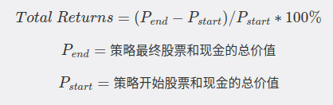

* **Total Annualized Returns / 策略年化收益**

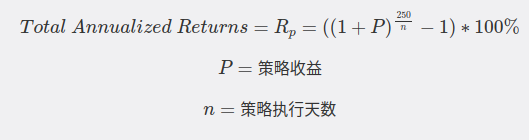

* **Alpha / 阿尔法**

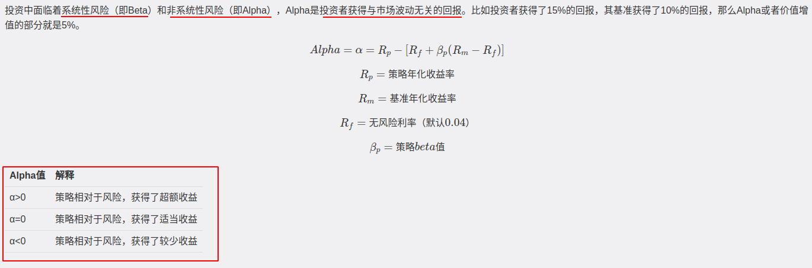

* **Beta / 贝塔**

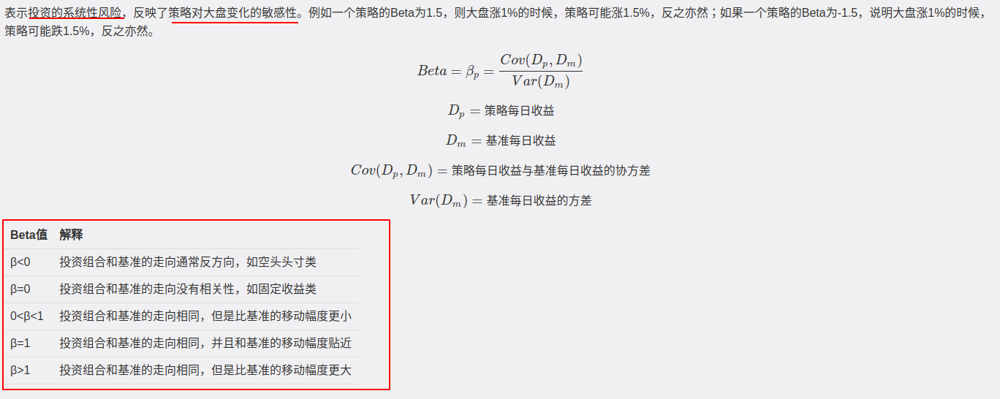

* **Sharpe / 夏普率**

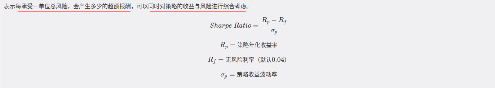

* **Sortino / 索提诺率**

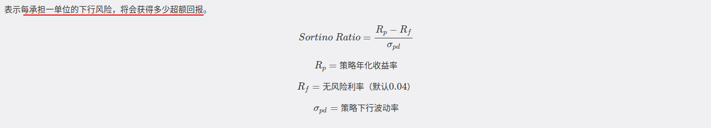

* **Information Ratio / 信息率**

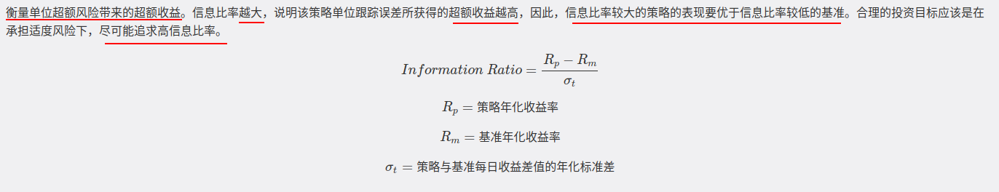

* **Algorithm Volatility / 策略波动率**

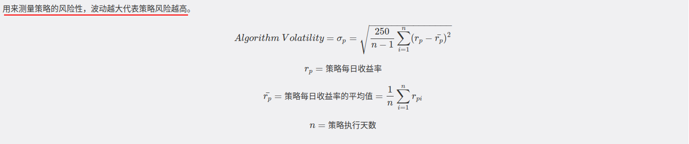

* **Benchmark Volatility / 基准波动率**

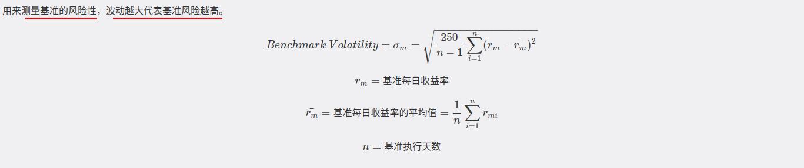

* **Max Drawdown / 最大回撤**

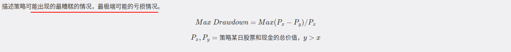

* **Downside Risk / 下行波动率**

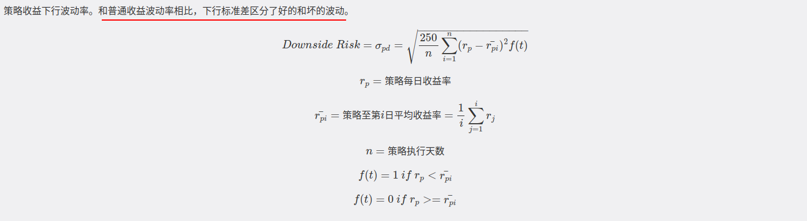

* **AEI / 日均超额收益**

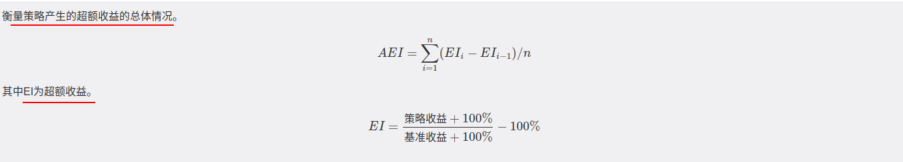

